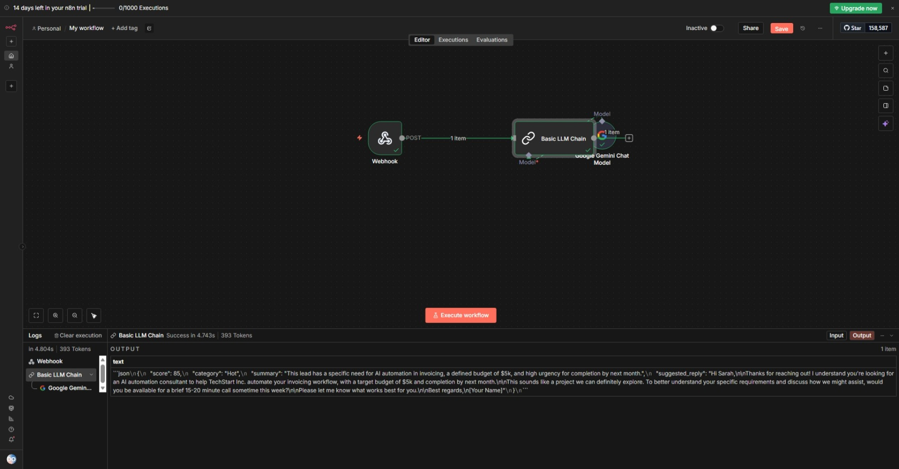

# 🤖 Gemini Lead Qualification Agent

### ⚡ The Problem
Sales teams waste 10+ hours/week filtering spam and drafting repetitive responses. High-value prospects often wait too long for a reply.

### 💡 The Solution
An automated AI Agent that intercepts web form submissions, analyzes them using **Google Gemini**, and instantly routes them to the correct team.

### 📸 The Workflow

### 🧠 How It Works
1.  **Ingestion:** Catches lead data via Webhook (n8n).
2.  **Reasoning:** A custom Gemini System Prompt analyzes the lead for:
    * **Budget Intent** (Is it defined?)
    * **Urgency** (Is there a deadline?)
    * **Fit** (Does it match our services?)
3.  **Routing:**
    * **Score > 80 (Hot):** Alerts Slack immediately.
    * **Score < 30 (Spam):** Auto-archives.
4.  **Action:** Uses RAG (Retrieval-Augmented Generation) to draft a personalized email response.

### 🛠️ Tech Stack
* **n8n** (Workflow Automation)
* **Google Gemini 1.5 Flash** (AI Logic)
* **JSON** (Structured Data Output)

---
*Created by Devine Enukorah - AI Automation Consultant*
